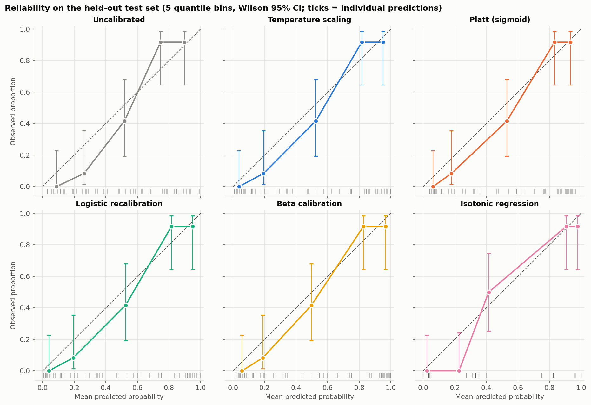
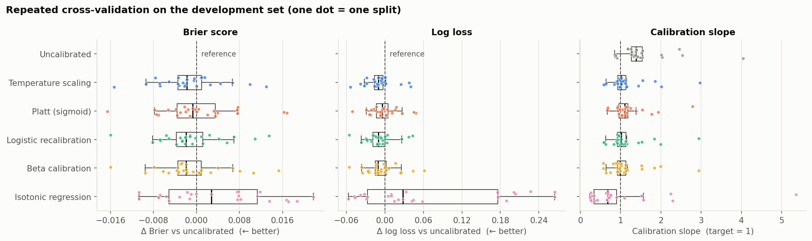
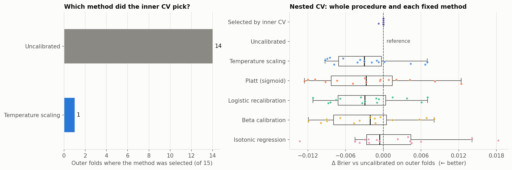

# Does post-hoc calibration help? Six calibration maps under cross-validation

[](https://github.com/bruno-acr/heart-disease-calibration/actions/workflows/tests.yml)


A Random Forest trained on the **UCI Heart Disease (Cleveland)** data discriminates well (AUC ≈ 0.9), but are its probabilities trustworthy? This project compares **six post-hoc calibration maps** and asks whether any improvement **holds up under proper validation**. The maps are no calibration, temperature scaling, Platt (sigmoid), logistic recalibration, beta calibration and isotonic regression. Validation uses cross-fitting, repeated CV, a pre-specified selection rule and nested CV.

👉 **Full analysis:** [`notebooks/calibration_analysis.ipynb`](notebooks/calibration_analysis.ipynb)



## Key findings

| | Uncalibrated | Best parametric maps¹ | Isotonic |
|---|---|---|---|
| Calibration slope, development CV (target 1) | 1.56 | 1.13-1.18 | 0.96 (very unstable) |
| Brier, development CV (5×5) | 0.1338 | 0.1325-0.1340 | 0.1375 |
| Brier, single held-out test split | 0.100 | 0.090 | 0.096 |
| **Brier, nested CV (15 outer folds)** | **0.1210** | **0.1185-0.1187** | 0.1225 |
| Accuracy at threshold 0.50, test | 88.5% | 88.5% | — |

¹ Temperature scaling, Platt, logistic recalibration and beta calibration perform almost identically.

1. **The forest is under-confident.** Its calibration slope is about 1.6: probabilities are pulled toward 0.5, as expected from averaging many trees.
2. **One or two parameters are enough.** The parametric maps fix most of the slope. Isotonic regression overfits with ~190 training records and is the worst option on average.
3. **A single test split overstated the benefit.** The held-out split showed a Brier gain of about 0.010, with a paired-bootstrap CI excluding zero. Nested CV puts the typical gain at about **0.0025**, four times smaller and within split-to-split noise.
4. **A pre-specified one-standard-error rule** keeps the uncalibrated model in 14 of 15 outer folds: the evidence for recalibrating is too weak to justify extra parameters.
5. **Better probabilities ≠ better classifications.** No test record crossed the 0.50 threshold, so accuracy, sensitivity and specificity are identical.

| Comparison across 25 CV splits | Nested CV: is the gain real? |
|---|---|
|  |  |

## Methods

```
303 records
├── Test set (20%, stratified) ─────────── evaluated once
└── Development set (80%)
    ├── 5×5 repeated stratified CV ─────── compare maps → one-SE rule selects one
    │     └── per training fold: cross-fitting (internal 5-fold OOF predictions → fit maps,
    │                            base model refitted on the whole fold)
    └── final cross-fitted fit ─────────── predict the test set
Nested CV (5×3 outer, 5×2 inner) repeats the whole procedure, selection included.
```

- **Leakage-safe pipeline:** imputation and one-hot encoding are fitted inside each training fold (`Pipeline` + `ColumnTransformer`). Hyperparameters are fixed a priori.
- **Cross-fitting:** calibration maps are fitted on out-of-fold probabilities, never on in-sample ones, and no record is reserved only for calibration. This is equivalent to `CalibratedClassifierCV(ensemble=False)`, and a unit test checks that the isotonic and Platt maps reproduce scikit-learn exactly / to 1e-4.
- **Metrics:** Brier score, Brier skill score, log loss, calibration intercept (calibration-in-the-large), calibration slope, AUC, average precision, reliability diagrams with Wilson intervals, and classification metrics at a fixed threshold.
- **Uncertainty:** paired comparisons on identical CV splits, a paired bootstrap on the test set, and nested CV for the whole procedure.

| Map | Params | Form |
|---|---|---|
| Temperature scaling | 1 | logit p' = logit(p) / T |
| Platt (sigmoid) | 2 | logit p' = a·p + b |
| Logistic recalibration | 2 | logit p' = a + b·logit(p) |
| Beta calibration | 3 | logit p' = c + a·ln p − b·ln(1 − p) |
| Isotonic regression | many | monotone step function |

## Repository layout

```
├── notebooks/calibration_analysis.ipynb   # the analysis, executed, with narrative
├── src/heartcal/
│   ├── data.py          # loading + SHA-256 check + outcome definition
│   ├── modeling.py      # preprocessing + Random Forest pipeline
│   ├── calibrators.py   # the six calibration maps (common fit/predict interface)
│   ├── metrics.py       # Brier, log loss, calibration intercept/slope, bootstrap, ...
│   ├── experiment.py    # cross-fitting, repeated CV, one-SE selection, nested CV
│   └── plotting.py      # figures
├── scripts/run_experiment.py   # reproduces every table in results/ and figure in figures/
├── tests/               # 21 unit tests (pytest), run on GitHub Actions
├── data/                # original UCI file + provenance
├── results/             # CSV/JSON outputs
└── figures/
```

## Reproduce

```bash
git clone https://github.com/bruno-acr/heart-disease-calibration.git
cd heart-disease-calibration
python -m venv .venv && source .venv/bin/activate
pip install -r requirements.txt

pytest -q                              # 21 tests, ~2 s
python scripts/run_experiment.py       # all results and figures, ~30 s on 10 cores
jupyter lab notebooks/calibration_analysis.ipynb
```

Results were produced with Python 3.14 and scikit-learn 1.7.2; other versions may differ slightly.

## Limitations

Small sample (303 records, 139 events), one fixed base model, and retrospective single-centre diagnostic data without external validation. This is a methodological study with no clinical validity. The standard error in the one-SE rule ignores the correlation between repeated-CV folds.

## References

- Janosi A, Steinbrunn W, Pfisterer M, Detrano R. *Heart Disease* [Dataset]. UCI ML Repository, 1989. https://doi.org/10.24432/C52P4X (CC BY 4.0)
- Platt J. Probabilistic outputs for support vector machines. *Advances in Large Margin Classifiers*, 1999.
- Zadrozny B, Elkan C. Transforming classifier scores into accurate multiclass probability estimates. *KDD*, 2002.
- Guo C et al. On calibration of modern neural networks. *ICML*, 2017.
- Kull M, Silva Filho T, Flach P. Beta calibration. *AISTATS*, 2017.
- Van Calster B et al. Calibration: the Achilles heel of predictive analytics. *BMC Medicine*, 2019. https://doi.org/10.1186/s12916-019-1466-7
- Huang Y et al. A tutorial on calibration measurements and calibration models for clinical prediction models. *JAMIA*, 2020. https://doi.org/10.1093/jamia/ocz228

## License

Code: MIT. Data: CC BY 4.0 (UCI).
