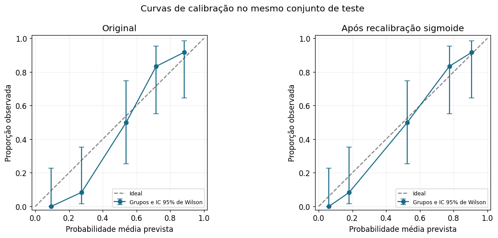
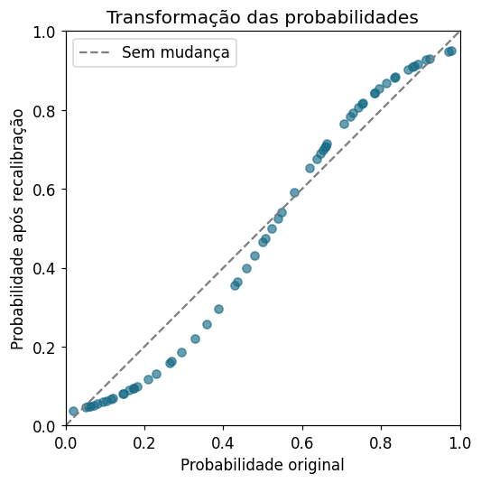
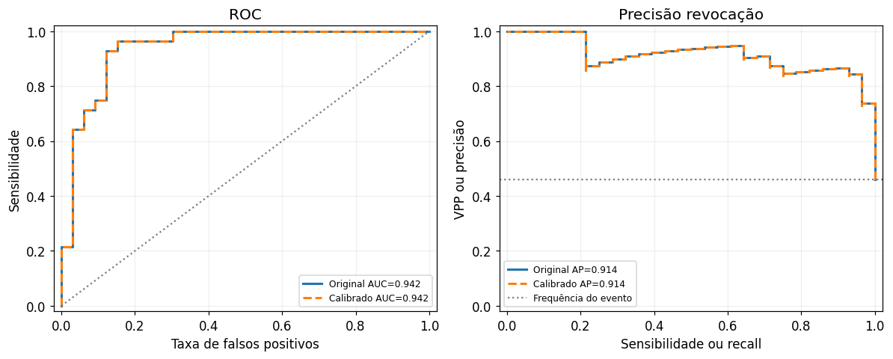

# Calibração de probabilidades em um modelo de doença cardíaca

Um modelo com AUC alta também produz probabilidades confiáveis? Este projeto treina uma **Random Forest** na base **Heart Disease (Cleveland) da UCI**, ajusta um **recalibrador sigmoide (Platt)** em um conjunto separado e compara, em um teste independente, o que muda nas probabilidades, na calibração, na discriminação e nas classificações.



## Destaques

- Pipeline sem vazamento de dados: imputação e one-hot encoding aprendidos apenas no treinamento (`Pipeline` + `ColumnTransformer`).
- Divisão em três papéis: **treinamento** (modelo), **calibração** (recalibrador via `CalibratedClassifierCV` + `FrozenEstimator`) e **teste** (avaliação).
- Avaliação completa das probabilidades: Brier score (com cálculo manual), Brier skill score, log loss, curvas de calibração com IC de Wilson, intercepto de calibração média e inclinação de calibração.
- Discriminação e classificação: AUC-ROC, average precision, curvas ROC e PR, matrizes de confusão, sensibilidade, especificidade, VPP, VPN, F1 e MCC.
- Incerteza: bootstrap pareado para as diferenças de Brier e de acurácia.
- Análise registro a registro das classificações que mudaram após a recalibração.

## Resultados

Conjunto de teste: 61 registros, 28 eventos.

| Medida | Original | Calibrado (sigmoide) |
|---|---|---|
| Brier | 0,110 | **0,098** |
| Brier skill score | 0,557 | **0,606** |
| Log loss | 0,367 | **0,330** |
| AUC-ROC | 0,942 | 0,942 |
| Intercepto de calibração média | −0,22 | −0,17 |
| Inclinação de calibração | 2,11 | 1,58 |
| Acurácia (limiar 0,50) | 88,5% | 90,2% |

- **As probabilidades melhoraram:** o Brier caiu 0,012 (IC 95% bootstrap pareado: −0,020 a −0,003).
- **A discriminação não mudou:** a transformação é monotônica, então AUC e average precision são idênticas.
- **A Random Forest original era moderada demais** (inclinação ≈ 2,1); a recalibração aproximou a inclinação de 1.
- **Classificações:** só 3 registros atravessaram o limiar. O ganho de acurácia não é robusto: o IC 95% (−3,3 a +8,2 p.p.) inclui zero.

Conclusão: melhorar a qualidade das probabilidades e melhorar os acertos de classificação são resultados distintos e devem ser avaliados separadamente.

| Transformação aprendida | ROC e precisão-revocação |
|---|---|
|  |  |

## Como executar

```bash
git clone https://github.com/bruno-acr/heart-disease-calibration.git
cd heart-disease-calibration
python -m venv .venv && source .venv/bin/activate
pip install -r requirements.txt
jupyter notebook calibracao_heart_disease.ipynb
```

O notebook já está salvo com os resultados executados (Python 3.14, scikit-learn 1.7.2). Em outras versões, pode haver pequenas variações nos números.

## Estrutura

```
.
├── calibracao_heart_disease.ipynb   # análise completa
├── data/processed.cleveland.data    # arquivo original da UCI (verificado por SHA-256)
├── figures/                         # figuras usadas neste README
└── requirements.txt
```

## Limitações

Amostra pequena (303 registros), uma única divisão treino/calibração/teste e cenário diagnóstico retrospectivo sem validação externa. O projeto é um estudo metodológico e não tem validade clínica.

## Dados e referências

- Janosi A, Steinbrunn W, Pfisterer M, Detrano R. *Heart Disease* [Dataset]. UCI Machine Learning Repository, 1989. https://doi.org/10.24432/C52P4X. Licença CC BY 4.0.
- Van Calster B et al. Calibration: the Achilles heel of predictive analytics. *BMC Medicine*, 2019. https://doi.org/10.1186/s12916-019-1466-7
- Huang Y et al. A tutorial on calibration measurements and calibration models for clinical prediction models. *JAMIA*, 2020. https://doi.org/10.1093/jamia/ocz228
- [scikit-learn: Probability calibration](https://scikit-learn.org/stable/modules/calibration.html)

## Licença

Código sob licença MIT. Os dados da UCI seguem a licença CC BY 4.0.
